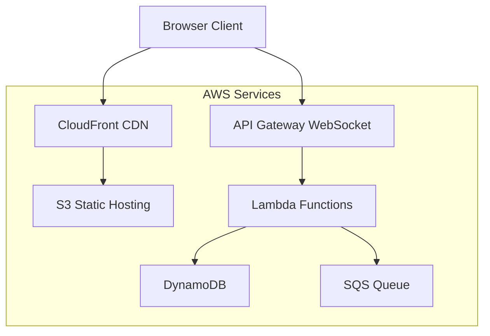

# Design Document

## Overview

The Maze Runner Game is a browser-based multiplayer game built using AWS cloud services with a focus on cost optimization and simplicity. The architecture follows a serverless approach using AWS Lambda, API Gateway WebSockets, and DynamoDB to minimize operational costs while providing scalable real-time multiplayer functionality.

The game client is a single-page application (SPA) built with HTML5 Canvas for rendering, vanilla JavaScript for game logic, and WebSocket connections for real-time multiplayer communication.

## Architecture

### High-Level Architecture



### Service Selection Rationale

- **S3 + CloudFront**: Cost-effective static hosting with global CDN
- **API Gateway WebSocket**: Managed WebSocket service, pay-per-connection
- **Lambda**: Serverless compute, pay-per-invocation, auto-scaling
- **DynamoDB**: NoSQL database with pay-per-request pricing
- **SQS**: Message queuing for genre-breaking mode coordination

## Components and Interfaces

### Frontend Components

#### Game Engine (`GameEngine.js`)
- Manages game state and rendering loop
- Handles player input and character movement
- Coordinates with multiplayer service for state synchronization
- Implements genre-breaking mode effects

#### Maze Generator (`MazeGenerator.js`)
- Generates random maze layouts using recursive backtracking algorithm
- Ensures all areas are reachable
- Places pellets and power pellets strategically

#### Multiplayer Client (`MultiplayerClient.js`)
- Manages WebSocket connection to API Gateway
- Sends player actions and receives game state updates
- Handles connection failures and reconnection logic

#### AI Controller (`AIController.js`)
- Implements pathfinding algorithms for enemy AI
- Adjusts difficulty based on game progression
- Manages enemy behavior during genre-breaking modes

### Backend Components

#### Connection Handler (`connectionHandler.js`)
- Lambda function for WebSocket connect/disconnect events
- Manages player sessions in DynamoDB
- Handles room creation and joining logic

#### Game State Manager (`gameStateManager.js`)
- Lambda function for processing game actions
- Updates game state in DynamoDB
- Broadcasts state changes to connected players

#### Genre Mode Controller (`genreModeController.js`)
- Lambda function triggered by CloudWatch Events
- Randomly selects and activates genre-breaking modes
- Sends mode change notifications via SQS

## Data Models

### Player
```javascript
{
  playerId: string,
  connectionId: string,
  roomId: string,
  position: { x: number, y: number },
  score: number,
  lives: number,
  isActive: boolean,
  lastUpdate: timestamp
}
```

### Game Room
```javascript
{
  roomId: string,
  players: [playerId],
  gameState: {
    maze: number[][],
    pellets: [{ x: number, y: number }],
    enemies: [{ x: number, y: number, direction: string }],
    currentMode: string,
    modeEndTime: timestamp
  },
  isActive: boolean,
  createdAt: timestamp
}
```

### Game Session
```javascript
{
  sessionId: string,
  playerId: string,
  gameMode: 'single' | 'multiplayer',
  score: number,
  level: number,
  startTime: timestamp,
  endTime: timestamp
}
```

## Error Handling

### Client-Side Error Handling
- **Connection Failures**: Automatic reconnection with exponential backoff
- **Invalid Moves**: Client-side validation before sending to server
- **Rendering Errors**: Graceful fallback to basic rendering mode
- **Browser Compatibility**: Feature detection with appropriate fallbacks

### Server-Side Error Handling
- **Lambda Timeouts**: Implement circuit breaker pattern
- **DynamoDB Throttling**: Exponential backoff with jitter
- **WebSocket Disconnections**: Cleanup player state after timeout
- **Invalid Game States**: State validation and correction mechanisms

### Error Recovery Strategies
- **Game State Corruption**: Regenerate maze and reset positions
- **Player Desynchronization**: Force state refresh from server
- **Service Unavailability**: Queue actions locally and replay when available

## Testing Strategy

### Unit Testing
- **Frontend**: Jest for game logic, maze generation, and AI algorithms
- **Backend**: Jest for Lambda functions with mocked AWS services
- **Coverage Target**: 80% code coverage for critical game logic

### Integration Testing
- **WebSocket Communication**: Test real-time message flow
- **Database Operations**: Test DynamoDB read/write operations
- **End-to-End Flows**: Test complete game sessions from start to finish

### Performance Testing
- **Client Performance**: Frame rate testing across different devices
- **Server Performance**: Load testing with multiple concurrent players
- **Network Performance**: Latency and bandwidth optimization testing

### Browser Compatibility Testing
- **Target Browsers**: Chrome, Firefox, Safari, Edge (latest 2 versions)
- **Mobile Testing**: iOS Safari, Android Chrome
- **Feature Testing**: WebSocket, Canvas, Local Storage support

### Cost Optimization Testing
- **AWS Usage Monitoring**: Track Lambda invocations, DynamoDB requests
- **Performance vs Cost**: Optimize for cost-effective resource usage
- **Scaling Tests**: Verify cost efficiency under different load patterns

## Genre-Breaking Modes

### Mode Types
1. **Speed Mode**: All characters move at double speed
2. **Ghost Mode**: Players can pass through walls for a limited time
3. **Darkness Mode**: Limited visibility around player
4. **Giant Mode**: Player character becomes larger
5. **Teleport Mode**: Random teleportation events
6. **Gravity Mode**: Pellets and players are affected by gravity, falling toward the bottom of the maze

### Mode Implementation
- Modes activate randomly every 2-3 minutes
- Each mode lasts 30-60 seconds
- Visual and audio cues indicate mode changes
- Modes affect all players in multiplayer games simultaneously

## Security Considerations

### Client Security
- Input validation for all player actions
- Rate limiting for WebSocket messages
- Sanitization of player names and chat messages

### Server Security
- AWS IAM roles with minimal required permissions
- API Gateway throttling and request validation
- DynamoDB encryption at rest and in transit
- Lambda function environment variable encryption